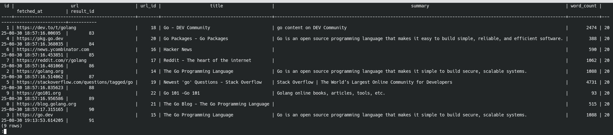
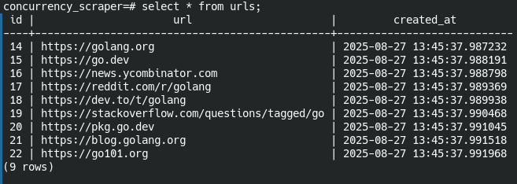
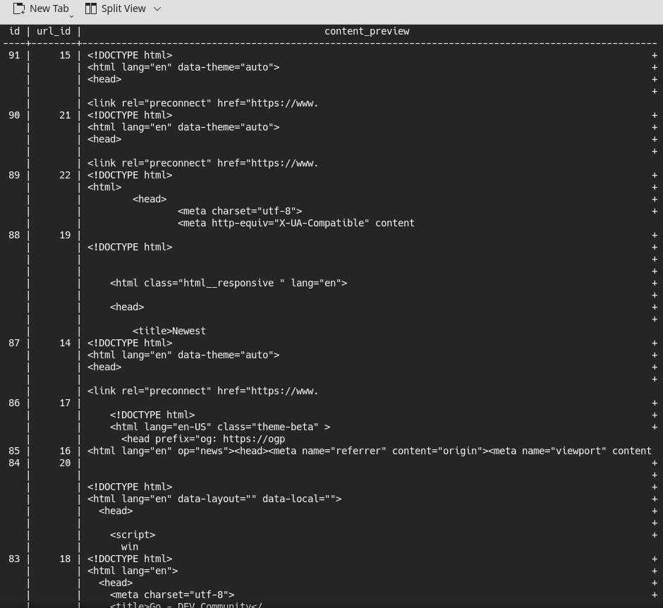
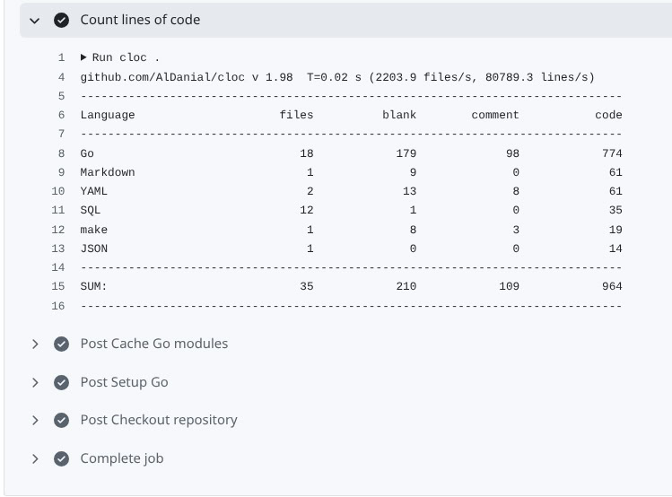
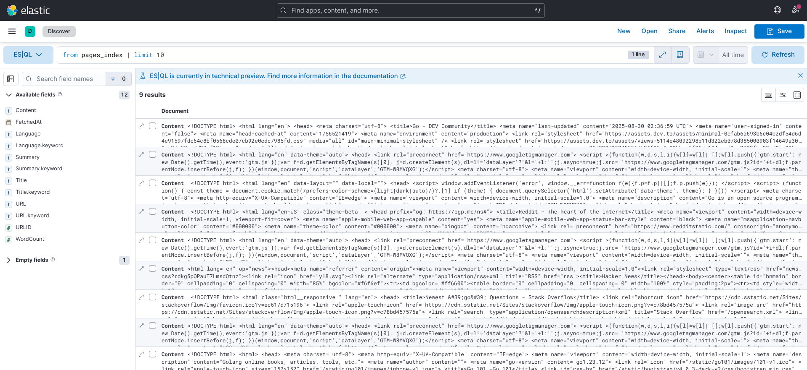

# Concurrency Scraper

Go-проект для параллельного веб-скрапинга с использованием Worker Pool и Crawler

Этот проект демонстрирует, как эффективно организовать параллельный веб-скрапинг в Go, используя модель Worker Pool и паттерн Crawler. Он предназначен для сбора данных с веб-страниц с учётом ограничений по количеству одновременных запросов и обработки ошибок.

Собранные данные могут быть индексированы в Elasticsearch, что позволяет быстро выполнять поиск и агрегацию по собранным страницам. Каждый результат скрапинга преобразуется в JSON и отправляется в указанный индекс, с уникальным идентификатором и опциональным роутингом для балансировки нагрузки. Это обеспечивает мгновенный доступ к свежим данным и возможность масштабируемого анализа больших объёмов информации.

## 📦 Структура проекта

cmd/scraper — точка входа приложения.

go.mod — управление зависимостями.

Makefile — скрипты для сборки и запуска.

```
├── cmd
│   ├── scraper
│   │   ├── __debug_bin4278510072
│   │   └── main.go
│   └── seed
│       └── main.go
├── coverage.out
├── docker-compose.yml
├── go.mod
├── go.sum
├── internal
│   ├── config
│   │   └── config.go
│   ├── db
│   │   ├── db.go
│   │   ├── db_test.go
│   │   └── sql_db.go
│   ├── es
│   │   ├── client.go
│   │   └── elasticsearch.go
│   ├── httpclient
│   │   ├── client.go
│   │   └── httpclient_test.go
│   ├── models
│   │   └── models.go
│   ├── scraper
│   │   ├── scraper.go
│   │   └── scraper_test.go
│   └── worker
│       ├── pool.go
│       └── pool_test.go
├── LICENSE
├── Makefile
├── migrations
│   ├── 001_create_urls.down.sql
│   ├── 001_create_urls.up.sql
│   ├── 002_create_results.down.sql
│   ├── 002_create_results.up.sql
│   ├── 003_create_pages.down.sql
│   ├── 003_create_pages.up.sql
│   ├── 004_add_unique_constraint_to_url_id.down.sql
│   ├── 004_add_unique_constraint_to_url_id.up.sql
│   ├── 005_add_results_fk_to_pages.down.sql
│   ├── 005_add_results_fk_to_pages.up.sql
│   ├── 006_add_raw_content_to_results.down.sql
│   └── 006_add_raw_content_to_results.up.sql
├── photo_2025-08-30_21-32-42.jpg
├── pkg
│   └── logger
│       ├── logger.go
│       ├── mock_logger.go
│       └── stdlogger.go
├── README.md
└── screenshots
    ├── github_ci_cd.jpg
    ├── kibana1.png
    ├── pages.png
    ├── results.png
    └── urls.png
```

## 🚀 Запуск проекта
``go run cmd/scraper/main.go``

## Особенности

Worker Pool: ограничивает количество одновременно работающих горутин для предотвращения перегрузки системы.

Crawler: рекурсивно обходит страницы, собирая ссылки и данные.

Обработка ошибок: надёжное управление ошибками при сетевых запросах и парсинге HTML.

Конфигурация: возможность настройки параметров скрапинга через переменные окружения или конфигурационные файлы.

## 🔧 Требования

Go 1.18+

Интернет-соединение для доступа к целевым веб-страницам

📄 Лицензия

Этот проект лицензируется под MIT License — подробности см. в файле LICENSE


Запуск проекта:
```GO
go run cmd/scraper/main.go

```
## Схема потока данных и работы горутин для функции Run.

🔗 Схема работы
```
 ┌───────────────┐
 │   main Run    │
 │ (основная)    │
 └──────┬────────┘
        │
        │ создаём results chan
        │ создаём pool
        │
   ┌────▼─────────────┐
   │ WaitGroup.Add(2) │
   └────┬─────────────┘
        │
 ┌──────▼───────┐          ┌─────────────────────────┐
 │ Горутина #1  │          │ Горутина #2             │
 │ (writer)     │          │ (submitter)             │
 │              │          │                         │
 │ for r :=     │          │ for _, u := range urls  │
 │   <-results  │◄───┐     │   pool.Submit(...)      │
 │   SaveResult │    │     │                         │
 │   SavePage   │    │     │ внутри воркера:         │
 └──────┬───────┘    │     │   Fetch → Parse →       │
        │            │     │   сформировать ScrapeResult
        │            │     │   results <- r──────────┘
        │            │     │
        │            │     │ pool.Close()
        │            │     │ close(results)
        │            │     └──────────────┐
        │            │                    │
        ▼            ▼                    │
     wg.Done()    wg.Done()               │
        │            │                    │
        └───────┬────┴─────────────┬─────┘
                ▼                  ▼
              wg.Wait()  →  Run завершён
```              

### 📝 Объяснение шагов

#### Главная функция (Run):
- Получает urls из базы.
- Создаёт pool и канал results.
- Добавляет 2 задачи в WaitGroup.

#### Горутина №1 (writer):
- Читает из канала results.
- Сохраняет данные в results и pages таблицы БД.
- Когда results закрыт и канал пуст → выходит из цикла → defer wg.Done() → готово.

#### Горутина №2 (submitter):
- Проходит по списку urls.
- Для каждого вызывает pool.Submit(...).
- Внутри пула воркеры делают:
- Fetch → goquery.Parse → формируют ScrapeResult → отправляют в results.
- Когда все urls отправлены → pool.Close() (ждёт завершения воркеров) → close(results).
- Выходит → defer wg.Done().

Главная горутина (Run) ждёт через wg.Wait(), пока обе закончат.

#### ✅ Ключевые моменты
- defer wg.Done() → в начале обеих горутин (writer + submitter).
- Закрытие канала results → только после того, как submitter закончил отправлять задачи и дождался пула (pool.Close()).
- writer завершается, когда results закрыт и канал пуст.

---
## База Данных Postgresql
```sql
select * from pages;
```

```sql
select * from urls;
```

```sql
SELECT id, url_id,  LEFT(content, 100) AS content_preview
FROM results
ORDER BY id DESC
LIMIT 10;
```


## Подсчёт сколько строк в GitHub CI/CD



## Elastic Search

Данные из Go-приложения отправляются в индекс `pages_index` Elasticsearch и доступны для запросов (лимит выборки: 10 записей).


### Отправка данных в Elasticsearch

Данные, полученные в Go-приложении (models.ScrapeResult), индексируются в Elasticsearch с помощью метода IndexPage. Процесс выглядит следующим образом:

### Сериализация в JSON
Go-структура ScrapeResult преобразуется в JSON с помощью json.Marshal.

### Выбор индекса
Документ отправляется в указанный индекс e.index.

### Отправка документа
JSON-документ передаётся в Elasticsearch через клиент e.client.Index.

### Задание ID документа
Каждому документу присваивается уникальный ID, равный result.URLID.

### Обновление индекса
Опция WithRefresh("wait_for") гарантирует, что документ сразу станет доступен для поиска.

### Тип операции
Используется операция index (можно заменить на create, если нужно падение при существующем ID).

### Роутинг по шардам
Для балансировки данных используется кастомный routing: result.URLID % 5.

### Таймаут
Максимальное время ожидания индексации — 5 секунд (WithTimeout(5*time.Second)).

Если операция завершилась с ошибкой, метод возвращает подробное описание ошибки, включая ID документа.
